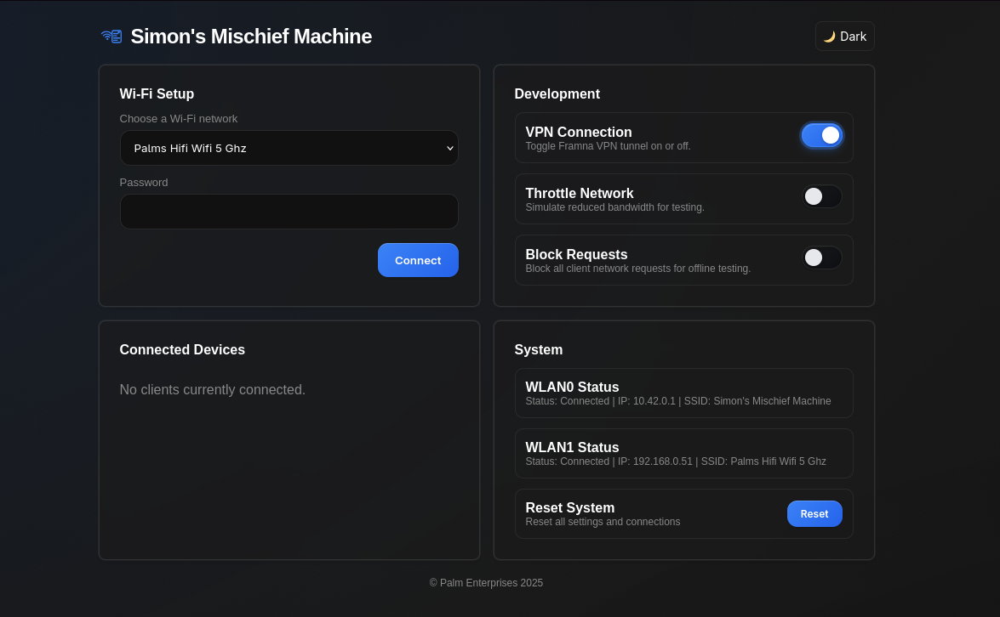

# Mischief Machine

A Flask-based web application for managing WiFi hotspot connections, VPN settings, and network controls.



## Quick Start

### Prerequisites
- Python 3.6+
- NetworkManager (`nmcli`)
- `iptables` and `tc` for network controls

### Installation
```bash
git clone <repository-url>
cd mischief-machine
pip install -r requirements.txt
```

### Configuration
Edit `app.py` and update the interface variables:
```python
wifi_device = "wlan1"    # Your WiFi interface
wifi_hotspot = "wlan0"   # Your hotspot interface
```

## Deployment

### Using the Deploy Script
```bash
./deploy.sh --host <remote_host> --dir <remote_directory>
```

**Examples:**
```bash
# Deploy to Raspberry Pi
./deploy.sh --host pi@192.168.1.100 --dir ~/mischief-machine

# Deploy with service restart
./deploy.sh --host pi@192.168.1.100 --dir ~/mischief-machine --service hotspot.service
```

**Deploy Script Options:**
- `--host <host>`: Remote host (required)
- `--dir <directory>`: Target directory (required)
- `--service <service>`: Systemd service name to restart
- `--clean`: Clean remote directory before deployment